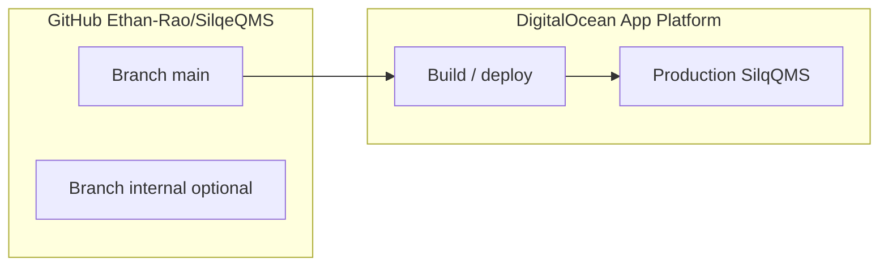

# Agent Prompt: Git workflow — segregate internal/QMS work from production code

## 1. Purpose of this document

You are being asked to **design and implement** (or document with concrete steps) a **Git branching and tagging workflow** for the **SilqeQMS** GitHub repository so that:

- **Production deployments** track **validated application software**, not every markdown refresh or internal planning artifact.
- **Design-control and software-validation records** (SW.SLQ007–SW.SLQ012 series) can cite **one authoritative Git reference** — typically an **annotated tag** resolving to a **full commit SHA** on the **deploy branch** — without ambiguity.
- **Humans and Cursor agents** can continue collaborating in the **same repository** with **clear rules** about which branch to push to and what counts as the “configuration item” under test.

This file is the **full charter**: read it before changing branches, GitHub settings, or DigitalOcean. When your work is complete, you owe the product owner a **short runbook**, **confirmed tooling behavior**, and a **copy-paste-ready designation block** for Word/PDF validation documents.

---

## 2. Organizational and program context

### 2.1 Company and project

**Silq Technologies Corporation** maintains a **paper-based QMS** governed by procedures such as **QM.SLQ001** (Document Control). **SilqQMS** is a **custom-developed web application** that acts as the **electronic document management system (EDMS)** for storing, revising, and retrieving controlled QMS documents.

**DC.SLQ002 — SilqQMS EDMS Transition** is the **design-control project** that covers:

- **Software verification and validation** of SilqQMS per **QM.SLQ032 A** (Software Validation SOP).
- **Transition** of day-to-day document operations from the legacy **FileHold** EDMS to SilqQMS.

Deliverables in the **SW.SLQ007 A through SW.SLQ012 A** series include the validation plan, product requirements specification (SRS), verification test plan/procedure, validation report, and requirements traceability matrix. Those Word documents live (or will live) under controlled paths such as `QMSInProcess/DC.SLQ002/` and are mirrored or extracted into **`docs/QMS-Readable-Texts/`** for review and agent-assisted editing.

### 2.2 Why Git hygiene matters for this program

Under ISO 13485–style design controls and typical internal procedures:

- **Design outputs** (the implemented software) must be **traceable** to **design inputs** (requirements in SW.SLQ008).
- **Verification evidence** (SW.SLQ010 execution, supplementary tests) must tie to a **specific build** of the software — not a moving target.
- Auditors and internal QA expect to answer: **“Which exact revision of the software was validated?”** A **Git commit on the production line** — preferably labeled with an **immutable annotated tag** — is the practical answer when SilqQMS is deployed from this repo.

If **internal documentation commits** and **application commits** share one undifferentiated stream, three problems appear:

1. **Report confusion** — SW.SLQ010/SW.SLQ011 cover pages say “SilqQMS version tested = Git SHA,” but the SHA at branch tip may reflect **docs-only** changes; that misstates what was exercised in production.
2. **Deployment noise** — If every push to `main` triggers **DigitalOcean App Platform** rebuilds, frequent doc pushes cause **unnecessary deploys**, churn, and noisy deployment history.
3. **Review burden** — Mixing hundreds of documentation commits with functional changes makes **release notes** and **change analysis** harder after validation.

Your workflow design should **reduce** these problems without blocking legitimate merges of doc tooling that truly belongs with the app (e.g. `scripts/refresh_dc_slq002_readable_texts.py`).

---

## 3. Technical system context (SilqQMS)

### 3.1 What the codebase is

The runnable application lives primarily under **`app/eqms/`** — a **Flask** (Python) web application with:

- **Document Control** — formal lifecycle (Draft / Released / Obsolete), uploads, audit events.
- **Admin Docs Libraries** — eleven browsable libraries, folders, uploads, moves, downloads.
- **Authentication**, **role-based access control**, **audit trail**, **CSRF** and **security headers**, integration with **PostgreSQL** and **S3-compatible object storage**.

Automated tests live under **`tests/`** (e.g. `pytest`). Deployment is commonly described as **DigitalOcean App Platform** with managed PostgreSQL and Spaces.

### 3.2 What is *not* part of the runtime

Much of the repo root is **supporting material**, not imported by the production process:

| Area | Role |
|------|------|
| `docs/design-assessment/` | Prompts, editing guides, gap analyses for controlled documents |
| `docs/QMS-Readable-Texts/` | Markdown extractions from Word/PDF for review (large surface area) |
| `QMSInProcess/` | Working copies of controlled Word/PDF deliverables (may or may not be tracked) |
| `docs/auditor_portal_file_list.csv` | Auditor-facing inventory metadata |
| Regulatory PDF libraries under repo paths | Reference only |

**Agents** routinely edit these paths. **None of them need to ship** on every production deploy unless the team explicitly chooses to version them on the deploy branch.

### 3.3 Deployment pipeline (conceptual)



**Your task** includes confirming in the real DigitalOcean UI **which branch** triggers `build` (expected: **`main`** only). If multiple branches or wildcard triggers exist, **narrow** them so **`internal`** (or similar) does **not** deploy production.

---

## 4. Regulatory traceability vocabulary

Use language consistent with existing editing guides in this repo:

| Term | Meaning in this program |
|------|-------------------------|
| **Configuration item** | The identified **SilqQMS software build** under validation — identified by **Git reference + deployment environment**. |
| **Design input** | Requirements in **SW.SLQ008 A** (SRS-1.1 through SRS-8.3). |
| **Verification** | Evidence that requirements are met — **SW.SLQ010** (manual), **SW.SLQ009** mapping, supplementary **pytest**, etc. |
| **Validation summary** | **SW.SLQ011 A** — concludes intended use; cites traceability in **SW.SLQ012 A**. |
| **Immutable reference** | **Annotated tag** pointing to one commit; **never** force-move after stakeholder release. |

The **designation string** you produce for `VALIDATED_CONFIGURATION_ITEM_DESIGNATION.md` is what authors paste into SW.SLQ010–012 — it must reference **`main`** (or the agreed deploy branch) and a **tag → SHA**, not an arbitrary agent branch.

---

## 5. Problem statement (expanded)

### 5.1 Symptoms the owner observed

- Commits mixing **documentation / prompts / extracts** with **`app/`** changes complicate **“what shipped?”**
- **GitHub Desktop / credential** switches can change **who pushes** or which account is active; **commit author** (`user.name` / `user.email`) is separate from **deploy branch** but both must be understood.
- **DigitalOcean** may rebuild on every push to the tracked branch — wasteful if pushes are mostly internal docs.

### 5.2 What success looks like

| Stakeholder | Success |
|-------------|---------|
| **QA / RA** | Reports cite **one tag + SHA** that resolves to the **deployed tested build**. |
| **Engineering** | **`main`** remains the protected line for **code + tests + deploy config**. |
| **Documentation / agents** | Frequent updates land on **`internal`** (or equivalent) **without** triggering production deploys. |
| **Operations** | Deployment list in DO maps cleanly to **meaningful application commits**. |

---

## 6. Recommended Git strategy (default implementation)

Implement unless you document a **better** alternative (e.g. monorepo split — usually rejected due to cost).

### 6.1 Branch: `main` — production / validated software line

- **Contains:** `app/`, `tests/`, `requirements.txt`, Docker/deploy specs, Alembic migrations, CI config, and any repo doc **required** to operate or audit the runtime (team decision).
- **DigitalOcean:** Auto-deploy **only** from **`main`** (verify).
- **Tags:** **Annotated validation tags** (`validated/silqqms-*`) are created **only** from commits reachable from **`main`** that represent the **frozen** build under test.

### 6.2 Branch: `internal` — internal workstream

- **Contains:** Bulk of `docs/design-assessment/**`, `docs/QMS-Readable-Texts/**`, prompts, editing-guide outputs, auditor CSVs, optional `QMSInProcess/**`, and similar.
- **Does not:** Trigger production deploy (must not be wired in DO).
- **Sync:** Regularly merge **`main` → `internal`** so agents see current application code and scripts; **avoid** merging **`internal` → `main`** except controlled PRs for agreed paths.

**Bootstrap (one-time):**

```bash
git fetch origin
git checkout main
git pull origin main
git checkout -b internal
git push -u origin internal
```

### 6.3 Cross-cutting files (scripts)

Some scripts under **`scripts/`** support doc extraction but are **Python** and may need to stay **testable on `main`**. Recommended policy (pick one and document in runbook):

- **Policy A — Scripts on `main`:** Keep extraction scripts on **`main`**; only bulk generated markdown stays on **`internal`** or is committed selectively.
- **Policy B — All scripts on `internal`:** Accept that CI on `main` does not run those scripts until promoted.

State clearly which policy you adopted.

### 6.4 Annotated tags — validated configuration item

When validation execution **starts or completes** against a specific production (or validation-environment) deployment:

```bash
git checkout main
git pull origin main
# Optionally confirm SHA matches DigitalOcean “live” deployment commit
git tag -a validated/silqqms-YYYY-MM-DD -m "SilqQMS DC.SLQ002 configuration item; SW.SLQ010/SW.SLQ011 scope."
git push origin validated/silqqms-YYYY-MM-DD
```

**Rules:**

- Tags are **immutable**; new validation cycle → **new tag** (new date or version suffix).
- Tag the **`main`** commit that **was actually deployed and tested**, not `internal`.

---

## 7. Design goals (required)

| ID | Goal | Success criterion |
|----|------|-------------------|
| **G1** | Deploy safety | Pushes that **only** change internal/doc paths **do not** trigger production deploy unless merged to **`main`** per intentional PR. |
| **G2** | Traceability | SW.SLQ010 / SW.SLQ011 / SW.SLQ012 cite a **tag + full SHA** that matches **`main`** at validation freeze. |
| **G3** | Agent clarity | Runbook fits **≤ ~2 printed pages**: branch for feature X, branch for docs Y, how to tag, how to verify SHA. |
| **G4** | Owner-facing designation | One **copy-paste block** for Word — no Git literacy required to use it. |
| **G5** | Credential hygiene | Runbook **reminds** developers to check `git config user.name` / `user.email` and GitHub Desktop active account for **Ethan-Rao** org pushes (document only; do not store secrets). |

---

## 8. Baseline audit (do first; do not assume)

1. **DigitalOcean App Platform:** Note **app name**, **region**, **GitHub repo** link, **branch** for deploy, whether **autodeploy** is on push or manual.
2. **`git remote -v`:** Confirm **`origin`** → `https://github.com/Ethan-Rao/SilqeQMS.git` (or SSH equivalent).
3. **GitHub:** Branch protection on **`main`**, list of deployment webhooks or GitHub integration.
4. **Recent history:** Use `git log --oneline -20` and classify commits **code vs docs** to illustrate the mixing problem in your handoff.

---

## 9. DigitalOcean checklist

- [ ] Deploy source = **`main`** only (or document alternate branch and align tags).
- [ ] **`internal`** (once created) is **not** a deploy branch.
- [ ] Autodeploy scope: **no** wildcard “all branches.”
- [ ] Document **where** to read **live deployment commit SHA** (Deployments tab).
- [ ] Note **buildpack/runtime** if relevant to reproducibility (Python version).

---

## 10. GitHub checklist

- [ ] **`internal`** exists on `origin`; default branch remains **`main`** (recommended).
- [ ] Branch protection on **`main`** as appropriate (PR required, status checks).
- [ ] Optional: **CODEOWNERS** or path-based rules for `app/` vs `docs/` (advanced).
- [ ] README or **`docs/design-assessment/Resources/GIT_BRANCH_RUNBOOK.md`** — owner-approved location only.

---

## 11. Collaboration rules (for the runbook)

Document these verbatim for humans/agents:

1. **Application change** (`app/`, `tests/`, migrations, runtime config) → feature branch from **`main`** → PR → **`main`** → deploy.
2. **Internal QMS / prompts / readable texts / auditor CSV** → branch from **`internal`** (or **`main`** then merge to **`internal`**) → push **`internal`** only.
3. **Never** cite **`internal` HEAD** as the validated software configuration in a regulatory document.
4. **Always** cite **annotated tag** + **full SHA** for the **`main`** commit under test.
5. After **`main`** advances and deploys, **`git checkout internal && git merge main`** (or PR) to refresh **`internal`**.
6. **Promotion `internal` → `main`:** Only via **small, intentional PRs** for agreed paths (e.g. a script fix needed for CI).

### Anti-patterns (call out in runbook)

- Pushing 50 MB of generated markdown to **`main`** just to “save work.”
- Tagging **`internal`** commits as “validated.”
- Moving or deleting **annotated validation tags** after sign-off.
- Letting **wrong `user.email`** persist globally so commits show a non-company identity (separate from branch logic but affects audit trail of *who* authored commits).

---

## 12. Mandatory deliverables

### 12.1 `docs/design-assessment/Output/VALIDATED_CONFIGURATION_ITEM_DESIGNATION.md`

Create or update with **this structure** (fill real values or **TBD** with instructions):

```markdown
# Validated SilqQMS configuration item (Git)

**Use the following as a single block in SW.SLQ010 / SW.SLQ011 / SW.SLQ012 (and DC.SLQ002 narrative where applicable):**

> SilqQMS validated software configuration: Git **annotated tag** `validated/silqqms-YYYY-MM-DD` → commit **`<full-40-char-sha>`** (`<short-7>`), branch **`main`**, repository **https://github.com/Ethan-Rao/SilqeQMS**.

**Verify anytime:**

`git fetch --tags && git rev-parse validated/silqqms-YYYY-MM-DD^{}`

**Deployment:** DigitalOcean App Platform deploys from branch **`main`** at commit `<short-7>` matching this tag at time of validation.

**Internal docs branch:** Active QMS/documentation work may continue on branch **`internal`** and does not change this designation until a new validation tag is created on a new `main` commit.
```

If validation has not run, keep tag/SHA as **TBD** and document **exact commands** the owner runs after the next freeze.

### 12.2 `docs/design-assessment/Resources/GIT_BRANCH_RUNBOOK.md`

Concise runbook: branches, diagram, merge directions, tagging ceremony, DO pointer, troubleshooting (**wrong branch**, **tag not pushed**, **SHA mismatch vs DO**).

### 12.3 Optional helper

`scripts/git_show_validation_designation.ps1` or `.sh` — prints latest `validated/silqqms-*` tag and resolved SHA (optional quality-of-life).

---

## 13. Implementation task list

- [ ] Complete **baseline audit** (§8).
- [ ] Create **`internal`**, push to **`origin`**, confirm GitHub shows both branches.
- [ ] Reconcile **DigitalOcean** branch trigger with **`main`-only** rule.
- [ ] Add **`VALIDATED_CONFIGURATION_ITEM_DESIGNATION.md`** (§12.1).
- [ ] Add **`GIT_BRANCH_RUNBOOK.md`** (§12.2).
- [ ] Document **script policy** (§6.3).
- [ ] Optional: helper script (§12.3).
- [ ] Final handoff message (§14).

---

## 14. Constraints

- Do **not** force-push **`main`** or rewrite **published** history without explicit owner approval.
- Do **not** move **validation tags** after stakeholders rely on them.
- Keep **application code changes** out of this task unless fixing something **blocking** the workflow (prefer docs + config instructions only).

---

## 15. Final handoff to the product owner (required)

Your closing message must include:

1. **Branches** — Roles of **`main`** vs **`internal`** (or substitutes).
2. **DigitalOcean** — Confirmed deploy branch and where to read live **commit SHA**.
3. **Designation block** — Exact paste-ready paragraph from **`VALIDATED_CONFIGURATION_ITEM_DESIGNATION.md`** (or TBD + fill steps).
4. **Next step** — When to create the first real **`validated/silqqms-…`** tag (typically right after a deployment intended for SW.SLQ010 execution).

That designation block is the **authoritative “correct designation” for validation reports** once filled with a real tag and SHA.

---

## 16. Related artifacts in this repo (for your orientation)

| Artifact | Purpose |
|----------|---------|
| `docs/design-assessment/Prompts/AGENT_PROMPT_DC_SLQ002_SW_SLQ010.md` | SW.SLQ010 editing-guide charter |
| `docs/design-assessment/Prompts/AGENT_PROMPT_DC_SLQ002_SW_SLQ011.md` | SW.SLQ011 validation-report charter |
| `docs/design-assessment/Output/SW_SLQ012_REQUIREMENTS_TRACEABILITY_MATRIX_EDITING_GUIDE.md` | RTM column semantics; cites Git SHA in design output |
| `docs/design-assessment/Output/SW_SLQ011_SOFTWARE_VALIDATION_REPORT_EDITING_GUIDE.md` | SW.SLQ012 referenced for traceability |
| `scripts/refresh_dc_slq002_readable_texts.py` | Docx/PDF → markdown refresh for DC.SLQ002 |

Use these to **align terminology** (SRS, test cases, configuration item) with what authors already put in Word deliverables.
