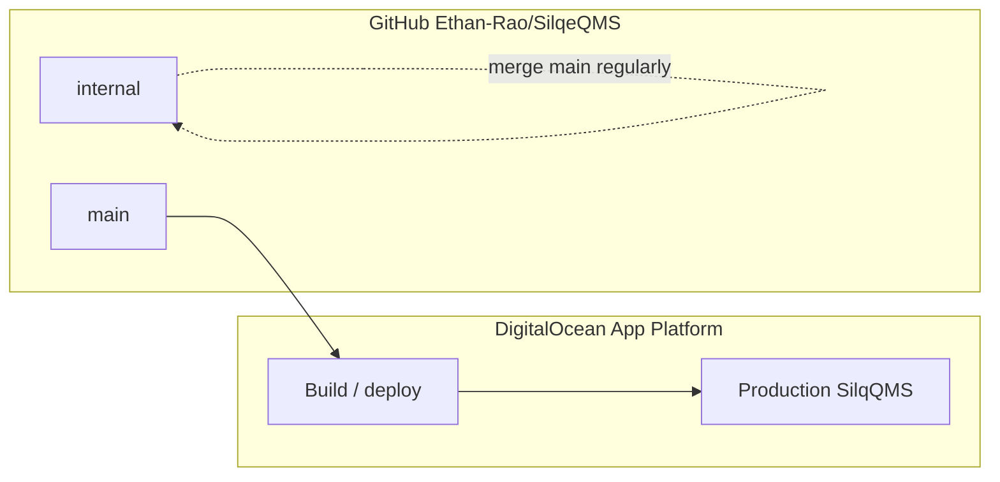

# Git branch runbook — SilqQMS (`Ethan-Rao/SilqeQMS`)

Concise rules for **production software** vs **internal QMS/docs** workstreams. Aligns with DC.SLQ002 / SW.SLQ007–SW.SLQ012 traceability expectations.

---

## 1. Branches at a glance

| Branch | Role |
|--------|------|
| **`main`** | Production / validated software line: `app/`, `tests/`, migrations, deploy config, CI. **DigitalOcean App Platform should auto-deploy only from here.** |
| **`internal`** | Internal QMS workstream: `docs/design-assessment/**`, `docs/QMS-Readable-Texts/**`, prompts, editing-guide outputs, auditor CSVs, optional `QMSInProcess/**`. **Must not** trigger production deploy. |



---

## 2. Collaboration rules (humans and agents)

1. **Application change** (`app/`, `tests/`, migrations, runtime config) → feature branch from **`main`** → PR → **`main`** → deploy.
2. **Internal QMS / prompts / readable texts / auditor CSV** → branch from **`internal`** (or work on **`internal`** directly if permitted) → push **`internal`** only — **not** `main` unless promoting specific paths via PR.
3. **Never** cite **`internal` HEAD** as the validated software configuration in a regulatory document.
4. **Always** cite an **annotated tag** + **full SHA** for the **`main`** commit under test (see §5).
5. After **`main`** advances and deploys, refresh **`internal`**: `git checkout internal && git merge origin/main` (or open a PR **internal** ← **main**).
6. **Promotion `internal` → `main`:** Only via **small, intentional PRs** for agreed paths (for example a script fix needed for CI).

### Anti-patterns

- Pushing large generated markdown churn to **`main`** “to save work.”
- Tagging **`internal`** commits as validated configuration items.
- Force-moving or deleting **annotated validation tags** after sign-off.
- Leaving **`user.email` / `user.name`** misconfigured so commits show the wrong identity (check per-repo: `git config user.name`, `git config user.email`; GitHub Desktop: confirm active account for **Ethan-Rao** org pushes).

---

## 3. Script policy (cross-cutting `scripts/`)

**Adopted: Policy A — scripts on `main`.**

- Extraction and maintenance scripts (for example `scripts/refresh_dc_slq002_readable_texts.py`) stay on **`main`** so they remain reviewable with application changes and can run in CI when needed.
- **Bulk generated markdown** and large doc extractions live on **`internal`** (or are committed selectively), not dumped onto **`main`** without intent.

---

## 4. Bootstrap / sync commands

**One-time: create `internal` from current `main`** (if not already on origin):

```bash
git fetch origin
git checkout main
git pull origin main
git checkout -b internal
git push -u origin internal
```

**Keep `internal` current with application changes:**

```bash
git checkout internal
git merge origin/main
# resolve conflicts if any; push when ready
git push origin internal
```

---

## 5. Annotated tags — validated configuration item

When validation execution targets a specific deployed build:

```bash
git checkout main
git pull origin main
# Optionally compare HEAD to DigitalOcean deployment commit SHA
git tag -a validated/silqqms-YYYY-MM-DD -m "SilqQMS DC.SLQ002 configuration item; SW.SLQ010/SW.SLQ011 scope."
git push origin validated/silqqms-YYYY-MM-DD
```

- Tags are **immutable**: each new validation cycle gets a **new** tag (new date or suffix).
- Tag only commits reachable from **`main`** that **were deployed and tested**.

**Resolve tag → SHA:**

```bash
git fetch --tags
git rev-parse validated/silqqms-YYYY-MM-DD^{}
```

Paste-ready designation template and updates: [`../Output/VALIDATED_CONFIGURATION_ITEM_DESIGNATION.md`](../Output/VALIDATED_CONFIGURATION_ITEM_DESIGNATION.md).

---

## 6. DigitalOcean (owner verification)

These steps must be confirmed in the **DigitalOcean App Platform** UI (agents cannot assume settings):

- [ ] Deploy source branch = **`main`** only (no wildcard “all branches”).
- [ ] **`internal`** is **not** configured as a deploy branch.
- [ ] Autodeploy: note whether **on push** or **manual**.
- [ ] **Live deployment commit SHA:** App → **Deployments** → select active deployment → compare to `git rev-parse main` / validation tag.

Document **app name**, **region**, and **runtime/buildpack** (for example Python version) in release notes when relevant.

---

## 7. Troubleshooting

| Symptom | What to check |
|--------|----------------|
| **Wrong branch** | `git branch --show-current`. App work → **`main`** via PR; docs → **`internal`**. |
| **Tag not pushed** | `git push origin validated/silqqms-YYYY-MM-DD` ; confirm on GitHub **Tags**. |
| **SHA mismatch vs DO** | DO deployment SHA vs `git rev-parse <tag>^{}` ; ensure tag was created on the same **`main`** commit that deployed. |
| **Credential / author** | `git config user.name` / `user.email`; GitHub Desktop account; commit author on GitHub commit page. |

---

## 8. Helper script

From repo root (Windows):

```powershell
.\scripts\git_show_validation_designation.ps1
```

Lists `validated/silqqms-*` tags and resolved SHAs (requires local `git`).
